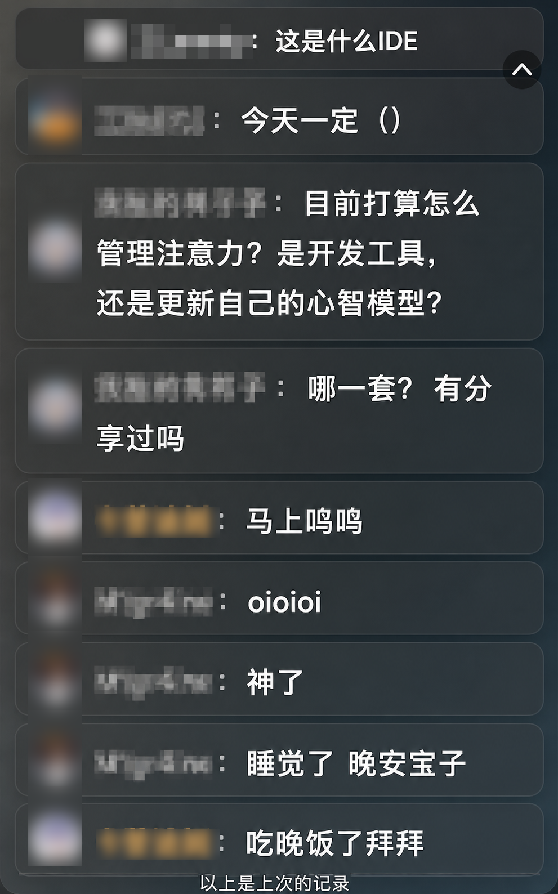
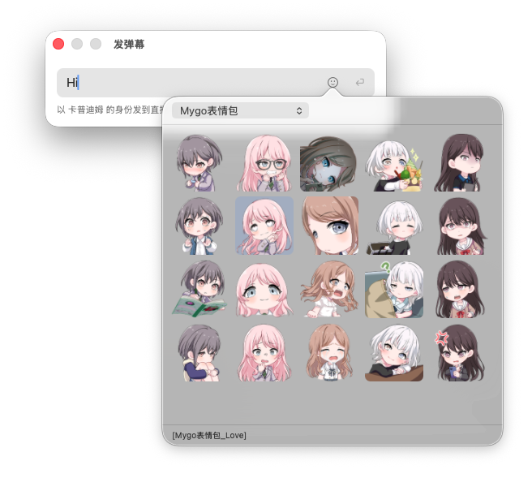

<p align="center">
  
</p>

# 弹幕窗 Namonaki

开播的时候，弹幕飘在桌面上，鼠标碰不到它，不挡你手上的活。想回谁一句，右键那条弹幕。

<p align="center">
  
  &nbsp;&nbsp;
  
</p>

## 能做什么

- 没有边框、背景透明、可以压在最上面，位置和深浅随便调
- 鼠标不碰到弹幕的时候，点击直接穿过去，后面的窗口照样点
- 右键一条弹幕直接 @ 他，左键能选中复制
- ⌥⌘D 发弹幕，直播间表情和自己的装扮表情都能发
- 三套预设，字大小、用户名深浅、底色浓淡随时拉
- 想让观众也看到的话，能接进 OBS，样式跟着一起变
- 关掉重开，最近 40 条还在

## 安装

macOS 14 以上。去 [Releases](https://github.com/nagi-studio/namonaki/releases) 下载，
用 M 系列芯片拿 arm64 那个，老款 Intel 或者不确定就拿 universal。双击挂载，把图标拖进「应用程序」。

**第一次打开会被系统拦下来。** 这个包没花钱买苹果的开发者签名，
去「系统设置 → 隐私与安全性」，往下滑找到被拦的 Namonaki，点「仍要打开」。

想自己编译也行，要 Xcode 16：

```sh
git clone https://github.com/nagi-studio/namonaki.git && cd namonaki
./build.sh && open build/Namonaki.app
```

装好之后菜单栏会多一个气泡图标。第一次启动自动弹设置面板，去
https://play-live.bilibili.com/ 复制身份码粘进去，点「保存并连接」就完事了。

两个快捷键：**⌥⌘E** 进出编辑模式（这时候才能拖窗口、改大小），**⌥⌘D** 发弹幕。

## 想让观众也看到弹幕？

桌面上那个窗口只有你自己看得见，观众看不到。要让弹幕进直播画面，
去设置页点「复制 OBS 地址」，粘进 OBS 的「浏览器源」。

那个地址是 app 自己开的，开 app 就有，你不用另外启动什么东西。不粘进 OBS 就等于不存在，
app 一关它也跟着关。

两边的样子是连着的：拉设置里的滑杆，画面里的弹幕跟着变，不用改两遍。

## 发弹幕要登录

看弹幕有身份码就够了。发弹幕得用你自己的 B 站账号：设置 → 账号 → 扫码登录。
发太快 B 站会拦，所以这边压到 1.2 秒一条。

不想发就不用登录，看和发是两件独立的事。

## 身份码和隐私

三件事你该知道：

1. 身份码要先发给 `api1.blive.chat`，才能开始收弹幕。**那台服务器是 blivechat 的**，
   不是我的，也不是 B 站的。它能看到你的 IP 和身份码。身份码填错的时候它会记一笔，
   所以 app 会先在本地检查格式，错了也不反复重试。
2. 弹幕内容不经过它。app 直接连 B 站收，OBS 那边只连你自己这台电脑。
3. 身份码和 B 站登录信息存在你电脑上的
   `~/Library/Application Support/Namonaki/credentials.json`，同一台机器上别的用户读不到。
   但它没加密，是明文——自己用够了，别当保险箱。

身份码相当于密码，直播和截图的时候别露出来。

## 已知限制

B 站的装扮表情在直播里能显示成图片。评论区那些基础表情包（小黄脸、热词那些）
发进直播弹幕只会变成 `[xxx]` 几个字，这是 B 站的限制，不是这边坏了。
表情面板里给这类包标了「只出文字」。

## 改 OBS 渲染页

桌面上那个窗口是原生画的，跟网页没关系。OBS 用的那个页面在 `web/` 里，
构建产物已经提交在 `Resources/Renderer`，所以平时编译不用装前端工具。
改了 `web/` 才要重建，用 bun：

```sh
cd web && bun install && bun run build
```

## 致谢

**[blivechat](https://github.com/xfgryujk/blivechat)**（xfgryujk，MIT）。B 站开放平台那套接口
怎么用，是照着它的实现读懂的；早期版本直接内嵌过它的前端。现在页面自己写了，但身份码换弹幕这一步，
走的还是它维护的 `api1.blive.chat` / `api2.blive.chat`——别人自己掏钱在跑的服务器。
许可证全文在 [`Resources/ThirdPartyNotices.md`](Resources/ThirdPartyNotices.md)。

**[bilibili-API-collect](https://github.com/pskdje/bilibili-API-collect)**。发弹幕那个接口的参数怎么填，
出自这里（`docs/live/danmaku.md`）。原仓库已经被清空了，上面这个链接是还活着的 fork。
装扮表情要加 `upower_` 前缀那条哪份文档都没写，是自己抓包抓出来的。

本项目跟 B 站、blivechat 都没关系，用出问题别去找他们。截图里的表情包版权归原作者。

## 许可证

MIT，见 [LICENSE](LICENSE)。
